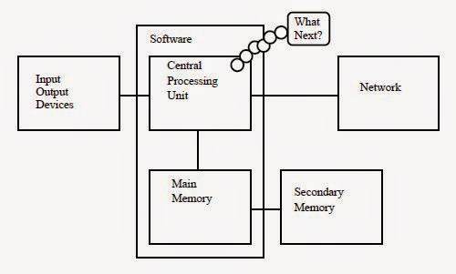
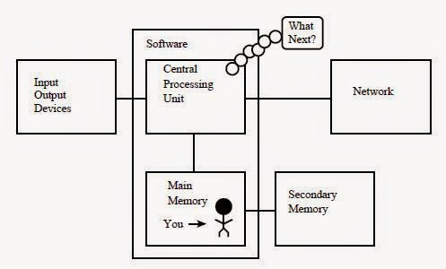
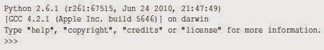

## რატომ უნდა ისწავლო პროგრამის დაწერა? 

პროგრამის დაწერა (პროგრამირება) არის ძალიან შემოქმედებითი და დაფასებული. შენ შეგიძლია დაწერო პროგრამა ბევრი მიზეზით ; აირჩიო ცხოვრების გზად მონაცემების ანალიზის პრობლემი გადაჭრა , უბრალოდ გაერთო, დაეხმარო ვინმე სხვას და.ა.შ.  ამ წიგნში ნათქვამია, რომ ყველას სჭირდება იცოდეს პროგრამირება და როცა შეისწავლი პროგრამირებას, შემდეგ მიხვდები რისი გაკეთება გინდა ახალშეძენილი ცოდნით.     ყოველდღიურ ცხოვრებაში ჩვენ გარშემორტყმული ვართ უამრავი მობილური ტელეფონით, კომპიუტერით, ლეპტოპით. ჩვენ შეგვიძლია ვიფიქროთ, რომ კომპიუტერები ჩვენი პირადი დამხმარეა, რომელსაც შეუძლია ჩვენთვის  იზრუნოს ბევრ რამეზე. დღეს კომპიუტერები შექმნილია იმისთვის რო მუდმივად დაგვისვას კითხვა" რა გინდა რომ გავაკეთო?" 

 

პროგრამისტები  კომპიუტერულ ტექნიკას ამატებენ ოპერაციულ სისტემას, აპლიკაციებს და ჩვენთვის მზადაა პერსონალური ციფრული ასისტენტი, რომელიც საკმაოდ სასარგებლო და უნარიანია დაგვეხმაროს ბევრ რამეში.     ჩვენი კომპიუტერი სწრაფია, აქვს უსაზღვრო მეხსიერება და შეუძლია იყოს ძალიან გამოსადეგი თუ გვეცოდინება ენა რომელზეც დაველაპარაკებით და ავუხსნით კომპიუტერს თუ "რა გააკეთოს". ეს ენა რომ ვიცოდეთ , შეგვეძლებოდა კომპიუტერისთვის მიგვეცა დავალებები, რომელსაც ჩვენთვის გააკეთებდა. განმეორებით ერთი და იგივე საქმეს  კომპიუტერი უფრო კარგად აკეთებს, მაშინ როცა ადამიანისთვის ასეთი საქმე ძალიან მოსაბეზრებელია.     მაგალითისთვის, დააკვირდით ამ თავში პირველ სამ პარაგრაფს და მითხარი ყველაზე ხშირად გამოყენებადი სიტყვა და რამდენჯერ იქნა გამოყენებული. სანამ შენ წაიკითხავდი  გაიგებდი და დათვლიდი სიტყვებს , ეს რამდენიმე წამი, მტანჯველია იმიტომ რომ ეს არაა იმ ტიპის პრობლემა რომლის გადასაჭრელადაც ადამიანის გონებაა შექმნილი.   კომპიუტერისთვის პირიქით; ქაღალდიდან წაკითხვა და გაგება ძნელია, მაგრამ სიტყვების დათვლა და თქმა რომელი სიტყვა იყო გამოყენებული ყველაზე ხშირად და რამდენჯერ ძალიან ადვილია.

```python	
python words.py 
Enter file: words.txt 
to 16
```
ჩვენმა პერსონალურმა ინფორმაციის გამაანალიზებელმა ასისტენტმა სწრაფად გვითხრა რომ   სამ პარაგრაფში სიტყვა "to" გამოყენებულ იქნა თექვსმეტჯერ.     ფაქტი რომ კომპიუტერები ზოგიერთ საქმეში ბევრად კარგია ვიდრე ადამიანი, არის მიზეზი იმისა, რომ ისწავლოთ ლაპარაკი "კომპიუტერის ენაზე". როცა ისწავლი ამ ახალ ენას ,  უკვე შეგიძლია პარტნიორს(კომპიუტერს) მიანდო ამქვეყნიური დავალებები და დაიტოვო მეტი დრო შენთვის, რომ აკეთო ის, რაც შენთვის შესაფერისია. ეს პარტნიორობა შენ მოგცემს მეტ გამჭრიახობას, შემოქმედობითობას და ინტუიციას.


## 1.1 შემოქმედობითობა და მოტივაცია 
 
 პროფესიონალური პროგრამირება შეიძლება იყოს კარგად ანაზღაურებადი სამსახური. შექმნა სასარგებლო, ელეგანტური და ჭკვიანი პროგრამა სხვებისთვის, არის ძალიან შემოქმედებითი საქმიანობა. თქვენი კომპიუტერი არის პირადი ციფრული ასისტენტი(პცა), რომელიც შეიცავს სხვადასხვა პროგრამისტების ჯგუფის მიერ დაწერილ  ბევრ განსხვავებულ პროგრამას. თითოეული ცდილობს მიიქციოს თქვენი ყურადღება და როგორც კი აირჩევთ რომელიმე პროგრამას, პროგრამისტის  შრომა ნაწილობრივ უკვე დაფასებულია თქვენი არჩევანის გამო.     თუ ვიფიქრებთ რომ პროგრამა არის  შემოქმედებითი პროდუქცია ,მაშინ ქვემოთ მოცემული გამოსახულება ყველაზე მეტად გამოხატავს ჩვენს პცა-ს: 

 
 
ამჟამად ჩვენი ძირითადი მოტივაციაა არ  ვთხოვოთ ფული საბოლოო მომხმარებლებს, სამაგიეროდ მოვითხოვოთ ვიყოთ უფრო პროდუქტიულები მონაცემებთან და ინფორმაციასთან რომელსაც გადავაწყდებით ჩვენს ცხოვრებაში. დასაწყისში შენ იქნები პროგრამისტი და მომხმარებელიც ჩვენი პროგრამის. რაც უფრო გაიზრდება შენი ცოდნა, პროგრამირებას შეიგრძნობ უფრო შემოქმედებითად და შეიძლება მოგინდეს კიდეც პროგრამების შექმნა სხვისთვის.


## 1.2 კომპიუტერის ტექნიკის არქიტექტურა 

სანამ იმ ენაზე დავიწყებდე ლაპარაკს ,რომელზეც კომპიუტერს მივცემთ ინსტრუქციებს პროგრამის კონსტრუირებისთვის, მანამდე საჭიროა ვისწავლოთ მცირედი იმის შესახებ თუ როგორაა კომპიუტერი მოწყობილი.  კომპიუტერს ან მობილურ ტელეფონს თუ გახსნი, დაინახავდი შემდეგ ნაწილებს:
 
 

  აღნიშნული ნაწილების  განმარტებები: 
   
- The Central Processing Unit (CPU) - ცენტრალური პროცესორი (ცპ) არის კომპიუტერის ნაწილი რომელიც შეპყრობილია კითხვით "რა არის შემდეგი?".  თუ თქვენს კომპიუტერს აქვს 3.0 გიგაჰერცი,  ეს ნიშნავს რომ ცპ გკითხავთ "რა არის შემდეგს?" სამ მილიარდჯერ ყოველ წამში. მოგიწევს ისწავლო როგორ ელაპარაკო სწრაფად ცპ -ს.      
- Main Memory -  ძირითადი მეხსიერება გამოიყენება იმ ინფორმაციის შესანახად , რომელიც სჭირდება ცპ -ს. ძირითადი მეხსიერება  დაახლოვებით ისეთივე სწრაფია როგორც ცპ, მაგრამ როცა კომპიუტერი გამორთულია  ძირითად მეხსიერებაში შენახული ინფორმაცია იკარგება.  
Secondary Memory - დამატებითი მეხსიერება ასევე გამოყნებულია ინფორმაციის შესანახად, მაგრამ ეს ბევრად უფრო ნელია, ვიდრე ძირითადი მეხსიერება. დამატებითი მეხსიერების უპირატესობა ისაა, რომ მას შეუძლია შეინახოს ინფორმაცია მაშინაც კი, როცა კომპიუტერს ელექტროენერგია არ მიეწოდება. დამატებითი მეხსიერების მაგალითებია მყარი და ფლეშ დისკები.      
- Input and Output Devices - შიდა და გარე მოწყობილობებია ეკრანი, კლავიატურა, თაგვი, მიკროფონი, დინამიკი, "თაჩფადი", და.ა.შ. ეს ყველაფერი არის კომპიუტერთან ურთიერთქმედების საშუალებები.    
- Network Connection - ქსელთან კავშირი დღეს უმეტეს კომპიუტერს აქვს ქსელიდან ინფორმაციის მოსაპოვებლად. ქსელზე შეგვიძლია ვიფიქროთ , როგორც ძალიან ნელ ადგილზე ინფორმაციის განსათავსებლად ან საპოვნელად, რომელიც შეიძლება ყოველთვის არ იყოს ხელმისაწვდომი. ამ გაგებით, ქსელი არის  დამატებითი მეხსიერების ნელი და არასაიმედო ფორმა.     სანამ ყველა დეტალს გავარჩევდეთ, ჯობია კომპიუტერის ნაწილები მის ინჟინრებს დავუტოვოთ  და ვილაპარაკოთ პროგრამაზე.     როგორც პროგრამისტი, შენი საქმეა არსებული რესურსების ორკესტრირება პრობლემის გადასაჭრელად თუ მონაცემების გასაანალიზებლად. როგორც პროგრამისტს უმეტესად "სალაპარაკო" გექნება ცპ-სთან  რო უთხრა თუ რა გააკეთოს. ხანდახან ცპ-ს ეტყვი რო გამოიყენოს ძირითადი მეხსიერება, დამატებითი მეხსიერება, ქსელი ან შიდა და გარე მოწყობილობები. 


 

შენ უნდა გახდე ადამიანი რომელიც ცპ-ს კითხვას "რა გავაკეთო" გასცემს პასუხს. მაგრამ არაკომფორტული იქნება 5 მილიმეტრის სიმაღლემდე დაპატარავება, კომპიუტერში შეძვრომა და წამში 3 მილიარდი ბრძანების გაცემა. ამის ნაცვლად წინასწარ უნდა  დავუწეროთ ინსტრუქცია. ასეთ ინსტრუქციას ვეძახით პროგრამას და ინსტრუქციის დაწერა/შემოწმებას - პროგრამირებას.


## 1.3 პროგრამირების გაგება

წიგნის დანარჩენ ნაწილში ჩვენ ვეცდებით გავზარდოთ თქვენი ცოდნა პროგრამირების ხელოვნებაში. ბოლოს შენ იქნები პროგრამისტი , სავარაუდოდ არაპროფესიონალი, მაგრამ იმდენი ცოდნით მაინც,  რომ გაარჩიო მონაცემები/ინფორმაცია, გააანალიზო პრობლემა და დაწერო პროგრამა ამ პრობლემის გადასაჭრელად.    
- პირველი, საჭიროა იცოდე პროგრამირების ენა (Python) - გქონდეს სიტყვათა მარაგი, იცოდე გრამატიკა. უნდა შეგეძლოს "წინადადების" გამართულად დაწერა ახალ ენაზე. 
- მეორე, უნდა შეგეძლოს "მოყვე ისტორია".  ისტორიის დაწერისას აერთიანებ სიტყვებს და წინადადებებს რომ მკითხველამდე იდეა მიიტანო. ისტორიის ლამაზად დაწერას ცოდნა უნდა. პროგრამირებაში პროგრამაა ჩვენი "ისტორია" და პრობლემა რომლის გადაჭრასაც ცდილობთ - "იდეა". 
რაკი ისწავლი ისეთ პროგრამირების ენას , როგორიცაა Python, ნახავ რომ სხვა ენების ( JavaScript, C++. ) სწავლა გაგიადვილდება. ახალი პროგრამირების ენა ძალიან განხვავდება როგორც გრამატიკულად ისე სიტყვიერად, მაგრამ მთავარია ერთხელ  ისწავლო პრობლემის გადაჭრა და შემდეგ პრობლემები ყველა მსგავსია სხვა ენებშიც.   

Python -ში "სიტყვებს" და "წინადადებებს' ადვილად ისწავლი.  უფრო მეტ დროს წაიღებს დაწერო დალაგებული პროგრამა. ჩვენ ვასწავლით პროგრამირებას ისე, როგორც ასწავლიან წერას. ჩვენ ვიწყებთ პროგრამის კითხვას, გარჩევას და შემდეგ ვწერთ მარტივ პროგრამას, შემდეგ და შემდეგ - უფრო და უფრო  რთულ პროგრამას. დროთა განმავლობაში დაიწყებ მიხვედრას როგორ დაწერო პროგრამა შენი პრობლემის გადასაჭრელად, და როგორც კი დაიწყებ მიხვედრას, პროგრამირება გახდება  სასიამოვნო და შემოქმედებითი პროცესი. ჩვენ ვიწყებთ Python - ის  სიტყვებით და სტრუქტურით. იყავი მომთმენი.

## 1.4 სიტყვები და წინადადებები

ადამიანური ენისგან განსხვავებით Python-ის სიტყვათა მარაგი ძალიან პატარაა.  ამ "სიტყვათა მარაგს" ვეძახით "განსაზღვრულ სიტყვებს". Python - ში ამ სიტყვებს აქვს განსაზღვრული მნიშვნელობა . როცა Python ხედავს ამ სიტყვებს 
Python პროგრამაში, მათ აქვთ მხოლოდ და მხოლოდ ერთი მნიშვნელობა. მოგვიანებით,
როცა დაწერ საკუთარ პროგრამას , გააკეთებ შენს სიტყვებს რომელსაც ექნება მნიშვნელობა და დაუძახებ ცვლადებს.შენ გექნება ფართო არჩევანი რომ შეურჩიო 
სახელები შენს ცვლადებს, მაგრამ არ შეგეძლება გამოიყენო Python - ის "განსაზღვრული სიტყვები" ცვლადებად. როცა ძაღლს ვწვრთნით, ჩვენ ვიყენებთ სპეციალურ სიტყვებს , როგორიცაა : ადექი, დაჯექი, მოიტანე. ასევე, როცა ველაპარაკებით ძაღლს და არ ვიყენებთ "განსაზღვრულ სიტყვებს" , ის უბრალოდ გვიყურებს უცნაური გამომეტყველებით , სანამ არ გამოვიყენებთ "განსაზღვრულ სიტყვას". მაგალითად:  თუ ვიტყვით " მე ვისურვებდი მეტი ადამიანი სეირნობდეს ჯანმრთელობის გასაუმჯობესებლად" , ძაღლი რასაც გაიგებს იქნება " ბლა ბლა სეირნობა ბლა ბლა ბლა". ასე იმიტომ მოხდება, რომ "სეირნობა " ძაღლისთვის არის "განსაზღვრული სიტყვა". ბევრმა შეიძლება თქვას რომ მსგავსი სიტყვები კატებისთვის უსარგებლოა.

 ენა რომელზეც უნდა ველაპარაკოთ Python-ს , შეიცავს შემდეგ სიტყვებს:  

[]()  | []() | []() 
------|------|------
**and** | **exec**| **not**
**as**| **finally**| **or**
**assert**| **for**	| **pass**
**break**| **from**| **print**
**class**| **global**| **raise**
**continue**| **if**| **return**
**def**| **import**| **try**
**del**| **in**| **while**
**elif**| **is**| **with**
**else**| **lambda**| **yield**
**except**|

ძაღლისგან განსხვავებით Python ბოლომდე გაწვრთნილია. რამდენჯერაც ეტყვი "try",
ის ყოველ ჯერზე გააკეთებს "try-ს" შეცდომის გარეშე.მომავალში ჩვენ ვისწავლით ამ "განსაზღვრულ სიტყვებს" და მათ გამოყენებას. Python-სთვის ყველაზე სასიამოვნო სათქმელია

```python	
print 'Hello world!'  
```

და აი ჩვენ უკვე დავწერეთ ჩვენი პირველი  სინტაქსურად  გამართული წინადადება Python-ში. ჩვენი წინადადება იწყება "განსაზღვრული სიტყვით" print რომელსაც მოსდევს  ჩვენი შერჩეული სტრინგი, რომელიც ჩასმულია ბრჭყალებში.

## 1.5  ლაპარაკი Python-თან

ახლა, როცა უკვე ვიცით სიტყვა და მარტივი წინადადება, გვჭირდება ვიცოდეთ როგორ დავიწყოთ ლაპარაკი Python - თან რომ შევამოწმოთ ჩვენი ცოდნა Python - ში.     სანამ Python - თან ილაპარაკებ, მანამდე საჭიროა დააინსტალირო Python პროგრამა შენს კომპიუტერში და შემდეგ ჩართო.  კარგი იქნება მოინახულო გვერდი www.pythonlearn.com სადაც დეტალურადაა ახსნილი თუ როგორ დააინსტალირო პროგრამა მაკზე და ვინდოუსზე. და როცა ტერმინალში ან ბრძანებათა ფანჯარაში დაწერ python - ს,  python -ის მთარგმენელი დიალოგურ რეჟიმში დაიწყებს მუშაობას და გამოჩნდება მსგავსი რამ:
 


 ეს ნიშანი  >>>  python -ის მთარგმნელში ნიშნავს რომ python მზადაა სალაპარაკოდ. ერთადერთი რაც გჭირდება ისაა, რომ იცოდე როგორ ილაპარაკო python - ის  ენაზე.     მოდი ვთქვათ რომ შენ არ იცი მარტივი წინადადებაც კი python - ის ენაზე. შენ ალბათ მოგინდება ისე გამოიყენო python,  როგორც ფილმებში უცხო პლანეტაზე მოხვედრილი კოსმონავტები ცდილობენ ელაპარაკონ  ადგილობრივებს.  
 

რაღაც ისე არაა... რამეს სწრაფად თუ არ მოიფიქრებ, პლანეტის ადგილობრივი მაცხოვრებელნი თავის შუბებით მოგკლავენ, შამფურზე წამოგაგებენ, შეგწვავენ და სადილად შეგჭამენ .     საბედნიეროდ ეს წიგნი თან გაქვს წაღებული.  საჩქაროდ გადაშალეთ ამ გვერდზე და სცადეთ კიდე ერთხელ:  

```python	
>>> print 'Hello world!' 
Hello world! 
```
 ეს გამოიყურება ბევრად უკეთ, ამიტომ სცადე ელაპარაკო უფრო მეტი:  

```python	
>>> print 'You must be the legendary god that comes from the sky' 
You must be the legendary god that comes from the sky 
>>> print 'We have been waiting for you for a long time' 
We have been waiting for you for a long time 
>>> print 'Our legend says you will be very tasty with mustard' 
Our legend says you will be very tasty with mustard 
>>> print 'We will have a feast tonight unless you say 
File "<stdin>", line 1 
print 'We will have a feast tonight unless you say 
ˆ 
SyntaxError: EOL while scanning string literal 
>>> 
```

 რა კარგად მიდიოდა ლაპარაკი  სანამ პატარა შეცდომას არ დაუშვებდი და Python - მა უკან დააბრუნა შუბები.   
 ამ ეტაპზე უნდა გააანალიზო, რომ Python არის საოცრად რთული, ძლიერი და მომთხოვნი იმ სინტაქსში , რომელსაც იყენებ Python - თან სალაპარაკოდ. Python არ არის გონიერი არსება. ეს შენ ელაპარაკები შენს თავს; უბრალოდ იყენებ დამახასიათებელ სინტაქსს.     გარკვეული აზრით, როცა იყენებ სხვის მიერ დაწერილ პროგრამას, კომუნიკაციაა შენსა და იმ სხვას შორის, ხოლო Python  არის შუამავალი. პროგრამისტისთვის Python  არის გზა გამოხატოს თუ როგორი ლაპარაკია ნავარაუდები.     სანამ Python - თან ჩვენს პირველ საუბარს მოვრჩებოდეთ, შენ ალბათ უნდა იცოდე გამართულად როგორ თქვა "ნახვამდის"..  

```python	
>>> good-bye 
Traceback (most recent call last): 
File "<stdin>", line 1, in <module> 
NameError: name 'good' is not defined 
>>> if you don't mind, I need to leave 
File "<stdin>", line 1 
if you don't mind, I need to leave 
ˆ 
SyntaxError: invalid syntax 
>>> quit() 
```

შეატყობდი რომ შეცდომა განსხვავებულია პირველ ორ მცდელობაში. მეორე შეცდომა განსხვავებულია , იმიტომ რო "if" არის განსაზღვრული სიტყვა (გს) და Python - მა რომ დაინახა (გს) , იფიქრა, რომ ვაპირებდით რაღაცის თქმას მაგრამ მერე შემთხვევით სინტაქსი შეგვეშალა.  სწორად რომ ვთქვათ "ნახვამდის' საჭიროა შევრონ  >>> პრომპტში დავწეროთ quit().

## 1.6 ტერმინოლოგია: მთარგმნელი და კომპილატორი

Python არის მაღალი დონის ენა შექმნილი იმისთვის, რომ ადამიანმა დაწეროს და წაიკითხოს  და კომპიუტერმა წაიკითხოს და დაამუშავოს. სხვა მაღალი დონის ენებია Java, C++, PHP, Ruby, Basic, Perl, JavaScript და კიდე ბევრი. ცენტრალურ პროცესორს არ ესმის ეს მაღლი დონის ენები. ცპ - ს ესმის ენა რასაც ვეძახით "მანქანის ენას" . ეს ენა ძალიან მარტივია და გულწრფელად რომ ვთქვათ ძალიან მომაბეზერებლი, იმიტომ რომ გამოხატულია მხოლოდ ნულებით და ერთიანებით :

01010001110100100101010000001111
11100110000011101010010101101101
...

მანქანის ენა ჩანს ძალიან მარტივი რადგან შედგება მხოლოდ ნულებით და ერთიანებით, მაგრამ მისი სინტაქსი  ბევრად უფრო რთული და არეულია ვიდრე Python-ის. ძალიან ცოტა პროგრამისტი ძალიან იშვიათად წერს ამ ენაზე. სანაცვლოდ ჩვენ შევქმენით სხვადასხვა მთარგმნელები, რათა საშუალება მიგვეცა პროგრამისტებისათვის დაეწერათ მაღალი დონის ენებზე, როგორიცაა Python ან JavaScript და მთარგმნელი პროგრამები გადათარგმნიდნენ მანქანის ენაზე ცპ-ს დახმარებით. 
მანქანის ენა არაა პორტაბელური კომპიუტერის ნაწილების განსხვავებულ მოდელებზე. მაღალი დონის პროგრამულ ენაზე დაწერილი პროგრამა შეიძლება გადაიტანო სხვა და სხვა კომპიუტერებზე, გამოიყენო სხვა და სხვა მთარმგნელი და კომპილატორი რომ ვთარგმნოთ კოდი მანქანის ენაზე.
პროგრამული ენის მთარგმნელი იყოფა 2 ძირითად კატეგორიად: 1) თარჯიმანი და 2) კომპილატორი ((1) interpreters and (2) compilers.).  
თარჯიმანი კითხულობს კოდს როგორც დაწერილია პროგრამისტის მიერ , არჩევს "გრამატიკულად" და თარგმნის . Python არის მთარგმენელი და როცა ვიყენებთ Python-ს ინტერაქტიულად, შეგვიძლია დავწეროთ წინადადება და Python მზადაა მაშინვე დაამუშავოს და მიიღოს ახალი წინადადება.
ხანდახან, როცა დაგჭირდება დაიმახსოვრო რაიმე სიდიდე , საჭიროა ამ სიდიდეს დაარქვა სახელი და შეგეძლება მოგვიანებთ გამოიყენო. ტერმინი ცვლადი...

```python	
>>> x = 6
>>> print x
6
>>> y = x * 7
>>> print y
42
>>> 
```
ამ მაგალითში Python - მა დაიმახსოვრა სიდიდე 6 როგორც x . მოგვიანებით შეგეძლება ამ სიდიდის გამოყნება. print ბრძანებით ვამოწმებთ ნამდვილად დაიმახსოვრა თუ არა სიდიდე. შემდეგ ვიძახებთ x - ს და ვამრავლებთ შვიდზე და მიღებულ მნიშვნელობას ვაძლევთ სიდიდე y - ს. და ბოლოს print ბრძანებით გამოგვაქს y - ს მნიშვნელობა.  
მიუხედავდ იმისა რომ თითო ბრძანებას თითო ხაზზე ვწერთ, Python is treating them as an ordered sequence of statements with later statements able to retrieve data created in earlier statements.   ვწერთ პირველ მარტივ პარაგრაფს 4 წინადადებით ლოგიკურ და აზრიან ბრძანებას,
მთარგმნელის თვისებაა რომ ქონდეს შესაძლებლობა ინტერაქტიულ რეჟიმში ლაპარაკის, როგორც ნაჩვენებია ზემოთ. კომპილატორს სჭირდება მიუთითო ფაილი, რომელსაც გადაიყვანს მანქანის ენაზე,
თუ გაქვს ვინდოუსი , განხორციელებად პროგრამებს აქვს გაფართოება(სუფიქსი) “.exe” ან “.dll”  რაც იკითხება როგორც “executable” და  “dynamically loadable library” .  რაც შეეხება ლინუქსს და მაკს, მათ არ აქვს უნიკალური სუფიქსი რაც აღნიშნავს რომ ფაილი "განხორციელებია".
განხორციელებად  პროგრამას თუ გახსნი ტექსტურ რედაქტორში ნახავ რო გამოიყურება გიჟურად და წაკითხვა შეუძლებელია.

ˆ?ELFˆAˆAˆAˆ@ˆ@ˆ@ˆ@ˆ@ˆ@ˆ@ˆ@ˆ@ˆBˆ@ˆCˆ@ˆAˆ@ˆ@ˆ@\xa0\x82
ˆDˆH4ˆ@ˆ@ˆ@\x90ˆ]ˆ@ˆ@ˆ@ˆ@ˆ@ˆ@4ˆ@ ˆ@ˆGˆ@(ˆ@$ˆ@!ˆ@ˆFˆ@
ˆ@ˆ@4ˆ@ˆ@ˆ@4\x80ˆDˆH4\x80ˆDˆH\xe0ˆ@ˆ@ˆ@\xe0ˆ@ˆ@ˆ@ˆE
ˆ@ˆ@ˆ@ˆDˆ@ˆ@ˆ@ˆCˆ@ˆ@ˆ@ˆTˆAˆ@ˆ@ˆT\x81ˆDˆHˆT\x81ˆDˆHˆS
ˆ@ˆ@ˆ@ˆSˆ@ˆ@ˆ@ˆDˆ@ˆ@ˆ@ˆAˆ@ˆ@ˆ@ˆA\ˆDˆHQVhT\x83ˆDˆH\xe8
....   

არაა ადვილი წაიკითხო და დაწერო მანქანის ენაზე ,  კარგია რო გვაქვს მთარგმნელი და კომპილატორი, რომელიც გვაძლევს საშუალებას დაბწეროთ Python
ან C-ში.  
Python - ის მთარგმნელი დაწერილია C-ში. შეგიძლია ნახო საწყისი  კოდი  საიტზე www.python.org . ვინდოუსში Python - ის განხორციელებადი მანქანის კოდია

C:\Python27\python.exe  

ეს იმაზე მეტია, ვიდრე ამჟამად გჭირდება რომ იცოდე.  
 

## 1.7. პროგრამის დაწერა 

Python- ის მთარგმნელში ბრძანებების დაწერა კარგი გზაა ექპერიმენტების ჩასატარებლად, მაგრამ არაა რეკომენდირებული რთული პრობლემის გადასაჭრელად.
როცა პროგრამის დაწერა გვინდა, ვიყენებთ ტექსტურ რედაქტორს სადაც ვწერთ ინსტრუქციებს Python-სთვის და რასაც ვეძახით სკრიპტს. Python - ის სკრიტის სახელი მთავრდება .py - ით.
სკრიპტის გასაშვებად პითონის მთარგმნელს უნდა მიუთითო ფაილის სახელი. უნიქსის ან ვინდოუსის ბრძანებათა ფანჯარაში უნდა დაწერო python hello.py


```python	
csev$ cat hello.py
print 'Hello world!'
csev$ python hello.py
Hello world!
csev$
```
csev$ არის ოპერატიული სისტემის პრომპტი . “cat hello.py” გვაჩვენებს რომ ფაილს “hello.py” აქვს ერთი ხაზი კოდი  - დაბეჭდოს სტრინგი.  
ჩვენ ვიძახებთ პითონის მთარგმენს რომ წაიკითხოს კოდი ფაილიდან “hello.py”
შეატყობდი რომ კოდის ბოლოს quit() - ის დაწერა არ იყო საჭირო. როცა პითონი კოდს ფაილიდან კითხულობს, იცის რომ უნდა გაჩერდეს როცა კოდის ბოლოში გავა.

## 1.8 რა არის პროგრამა?

პროგრამის ძირითადი განსაზღვრებაა დაალაგო პითონის წესები ისე, რომ რამე გააკეთოს. მარტივი hello.py სკრიპტიც კი პროგრამაა. ესააა ერთხაზიანი პროგრამა , არცთუ ისე სასარგებლო, მაგრამ მკაცრი განსაზღვრებით- პითონ პროგრამაა.  

უფრო ადვილი იქნება გავიგოთ თუ რა არის პროგრამა თუ ვიფიქრებთ პრობლემაზე, რომლის გადასაჭრელადაც დაიწერა პროგრამა. ვთქვათ ფეისბუქზე ატარებ სოციალურ კვლევას და გაინტერესებს პოსტებში ყველაზე ხშირად გამოყენებული  სიტყვა. შეგეძლო წაგეკითხა უამრავი პოსტი და თვალები დაგეთხარა ასეთი სიტყვის ძებნაზე, მაგრამ ეს წაიღებდა ბევრ დროს და შეცდომის დაშვების ალბათობაც დიდი იქნებოდა. ჭკვიანური იქნებოდა დაგეწერა პითონის პროგრამა შესაბამისი დავალებით, რომელიც ადვილად და აკურატულად შეასრულებდა დავალებას და  ამ დროს შენ სხვა რამით დაკავდებოდი.  

მაგალითად შეხედე ტექსტს  კლოუნის და მანქანის შესახებ. შეხედე და გამოითვალე რომელია ყველაზე ხშირად გამოყყენებადი სიტყვა და რამდენჯერაა გამოყენებული.

`the clown ran after the car and the car ran into the tent
and the tent fell down on the clown and the car`

შემდეგ წარმოიდგინე, რომ აკეთებ იგივე დავალებას მილიონობით სტრიქონისგან შემდგარ ტექსტზე. გულწრფელად რომ გითხრა, შენთვის უფრო ადვილი იქნება ისწავლო პითონი და დაწერო პროგრამა, ვიდრე სათითაოდ  დაათვალიერო სიტყვები.
მთლად უკეთესი; უკვე არის მარტივი პროგრამა, რომელიც პოულობს ყველაზე ხშირად გამოყენებულ სიტყვას ტექსტურ ფაილში. მე დავწერე და შევამოწმე ეს პროგრამა და ახლა შენ გაძლევ, რომ გამოიყენო და ცოტა დრო დაზოგო.

```python	
name = raw_input('Enter file:')
handle = open(name, 'r')
text = handle.read()
words = text.split()
counts = dict()

for word in words:
  counts[word] = counts.get(word,0) + 1

bigcount = None
bigword = None
for word,count in counts.items():
  if bigcount is None or count > bigcount:
    bigword = word
    bigcount = count

print bigword, bigcount
```

პითონის ცოდნაც არ გჭირდება ამ პროგრამის გამოსაყენებლად.  დაგჭირდება 10 თავამდე მისვლა რომ სრულად გაიგო ამ პროგრამაში გამოყენებული ტექნიკა.  

შენ ხარ მომხმარებელი რომელიც მარტივად იყენებს ამ პროგრამას და გაოცებს მისი მოხერხებულობა თუ როგორ გადაგარჩინა თვალების დათხრას. მარტივად დაწერ კოდს ფაილში სახელად words.py და გაუშვებ ან აქედან  გადმოიწერე კოდი და გაუშვი http://www.pythonlearn.com/code/ .  

ეს არის მარტივი მაგალითი თუ როგორ მოქმედებს პითონი, როგორც შუამავალი მომხმარებელსა და პროგრამისტს შორის. პითონი არის გზა რომ გავცვალოთ სასარგებლო პროგრამები საერთო ენაზე რომელიც შეუძლია გამოიყენოს ყველამ ვინც დააყენებს პითონს თავის კომპიუტერზე. ასე რომ არც ერთი ჩვენგანი არ ელაპარაკება პითონს, სანაცვლოდ ჩვენ ველაპარაკებით ერთმანეთს პითონის დახმარებით.


## 1.9 პროგრამის ასაშენებელი ბლოკები

შემდგეგ თავებში ჩვენ ვისწავლით უფრო მეტს პითონის ლექსიკონის, წინადადების სტრუქტურის, პარაგრაფის სტრუქტურის და ისტორიის სტრუქტურის შესახებ. ვისწავლით პითონის მძლავრი შესაძლებლობების შესახებ და თუ როგორ დავალაგოთ ეს შესაძლებლობები ისე, რომ გავაკეთოთ სასარგებლო პროგრამა.
არის რამდენიმე არც ისე მაღალი დონის აბსტაქტული ნიმუში, რომელსაც გამოვიყენებთ პროგრამის შესადგენად. ეს კონსტრუქციები გამოიყენება არა მარტო პითონში, არამედ  მანქანის ენიდან დაწყებული ყველა პროგრამირების ენაში.

- შეყვანა (ინფორმაციის) input : მონაცემების მიღება "გარედან". ეს შეიძლება იყოს მონაცემების წაკითხვა ფაილიდან ან რაიმე სენსორული მოწყობილობიდან, როგორიცაა მიკროფონი ან ჯი-პი-ესი. შენს საწყის პროგრამებში ინფორმაციის შეყვანა გამოიხატება მომხმარებლის მიერ კლავიატურაზე  აკრეფილი მონაცემებით.
- გამოტანა (ინფორმაციის) output:  პროგრამის შედეგის ეკრანზე  გამოტანა ან ფაილში შენახვა ან ჩაწერა მოწყობილობისთვის, მაგ: დინამიკისთვის რომ გააჟღეროს მუსიკა ან ლაპარაკი.
- თანმიმდევრული განხორციელება sequential execution : ბრძანებების რიგ-რიგობით შესრულება - ისე როგორც მითითებულია სკრიპტში.
- პირობითი განხორციელება conditional execution :  შეამოწმოს პირობები და შეასრულოს ან გამოტოვოს ბრძანებები.
- განმეორებადი განხორციელება repeated execution : ბრძანებ(ებ)ის შეასრულება არაერთხელ - როგორც წესი რამდენიმე ვარიაცია.
- განმეორებითი გამოყენება reuse : დაწერე ინსტრუქცია ერთხელ, დაარქვი სახელი და შენს პროგრამაში გამოიყენე როცა დაგჭირდება.

სიმართლე გითხრა , ეს ყველაფერი ძალიან მარტივი ჩანს, მაგრამ ეს არასდროსაა ესეთი მარტივი. ესაა როგორც თქვა,  რომ სეირნობაა ერთი ფეხის გადაბიჯება მეორეს წინ.  პროგრამირების ხელოვნება იმაში მდგომარეობს, რომ ეს მთავარი ელემენტები დააწყო ისე, რომ მომხმარებლისთვის გააკეთოს რაიმე  სასარგებლო.  ზემოთ მოყვანილი სიტყვების დასათვლელი პროგრამა იყენებს ყველა ნიმუშს ერთის გარდა.

## 1.10 რა შეიძლება გაკეთდეს არასწორად?

პითონთან წინა ლაპარაკის დროს როგორც  ვნახეთ , ძალიან ზუსტად უნდა დავწეროთ პითონის კოდი. მცირე გადახრა ან შეცდომაც კი პითონს დააბნევს.
დამწყები პროგრამისტები ხშირად ფიქრობენ, რომ რადგან პითონი შედომისთვის ადგილს არ ტოვებს, აშკარაა რომ ის უნამუსო ,საძულველი და სასტიკია. რომ პითონს აქვს მათდამი პირადი შუღლი და ამ შუღლის გამო, მათ მიერ შესანიშნავად დაწერილ პროგრამას ასაღებს როგორც ნაგავს მხოლოდ იმიტომ, რომ ისინი  დატანჯოს!


```python	
>>> primt 'Hello world!'
File "<stdin>", line 1
primt 'Hello world!'
ˆ
SyntaxError: invalid syntax
>>> primt 'Hello world'
File "<stdin>", line 1
primt 'Hello world'
ˆ
SyntaxError: invalid syntax
>>> I hate you Python!
File "<stdin>", line 1
I hate you Python!
ˆ
SyntaxError: invalid syntax
>>> if you come out of there, I would teach you a lesson
File "<stdin>", line 1
if you come out of there, I would teach you a lesson
ˆ
SyntaxError: invalid syntax
>>> 
```


პითონთან კამათი უსარგებლოა. ის უბრალოდ უემოციო ხელსაწყოა, რომელიც ყოველთვის მზადაა გემსახუროს.  შეცდომის მესიჯები არასასიამოვნოდ კი გამოიყურება, მაგრამ ეს მესიჯები ნიშნავს რომ პითონს დახმარება სჭირდება, რომ ვერ გაიგო შენი ნაწერი და გთხოვს უკეთ დაწერო.
პითონი ძაღლს ჰგავს. უყვარხარ უპირობოდ, იცის რამდენიმე სიტყვა, გიყურებს სასიამოვნო გამომეტყველებით (>>>) და გელოდება უთხრა ისეთი რამე, რასაც გაიგებს. როცა პითონი ამბობს “SyntaxError:invalid syntax” ,  ეს უბრალოდ კუდს აქიცინებს და გეუბნება, რომ  "რაღაცას ამბობდი, მაგრამ ვერ გავიგე რას გულისხმობდი. ამის მიუხედავად გთხოვ გააგრძელე ჩემთან ლაპარაკი (>>>) . "
რაც უფრო გაიზდება შენი გამოცდილება პროგრამირებაში, შეხვდები 3 ძირითად შეცდომას:  

- სინტაქსის შეცდომას Syntax errors :  ესაა პირველი შეცდომები, რომელსაც დაუშვებ ; სხვათაშორის ყველაზე ადვილად  გამოსწორებადი შეცდომა. Syntax errors ნიშნავს რომ დაარღვიე პითონის "გრამატიკის წესები“. პითონი მიგანიშნებს სტრიქონს  და ასოს, სადაც შეცდომაა დაშვებული. სინტაქსის შეცდომაში ცოტათი რთული მხოლოდ ისაა, რომ ხანდახან შეცდომა რომელსაც გამოსწორება სჭირდება დაშვებული იქნა პროგრამის წინა სტრიქონებში და არა მხოლოდ იქ სადაც  პითონმა მიგანიშნა. ასე რომ სტრიქონი და ასო რომელზეც პითონი სინტაქსის შეცდომას მიანიშნებს, შეიძლება იყოს საწყისი წერტილი შენი გამოძიების.  

- ლოგიკის შეცდომა Logic errors :ლოგიკის შეცდომაა, როცა სინტაქსი გამართულია, მაგრამ შეცდომაა წესებთან დაკავშირებით ან წესების ურთიერთშეთანხმებასთან დაკავშირებით.   

- სემანტიკური შეცდომა Semantic errors: სემანტიკური შეცდომაა როცა ზომების მიღების აღწერა სინტაქსურად სწორია, მაგრამ პროგრამაში დაშვებულია მარტივი შეცდომა. პროგრამა სწორადაა დაწერილი მაგრამ არ აკეთებს იმას რისთვისაც იყო განზრახული.  მარტივი მაგალითია ; დავუშვათ მეგობარს  ასწავლით გზას "... როცა გზაჯვარედინთან მიხვალ, ბენზინგასამართ სადგურთან მოუხვიე მარცხნივ, გაიარე 1 მილი და წითელ რესტორანს დაინახავ შენგან მარცხნივ." მოგვიანებით მეგობარი გირეკავს და გეუბნება, რომ ისაა ფერმაში და მის უკან ბეღელია და არანაირი ნიშანი არაა, რომ აქ სადმე რესტორანია. შემდეგ შენ ეკითხები "ბენზინგასამართ სადგურთან მარჯვნივ მიუხვიე თუ მარცხნივ?" და ის გპასუხობს, რომ როგორც ასწავლე ისე წავიდა და შენ ამბობ " ძალიან ვწუხვარ, იმიტომ რომ ჩემი ინსტრუქცია სინტაქსურად სწორი იყო, მაგრამ დავუშვი პატარა სემანტიკური შეცდომა."
ყველა ტიპის შეცდომის მიუხედავად პითონი ყველანაირად ეცდება გააკეთოს რაც სთხოვეთ.

## 1.11 სწავლის მოგზაურობა

ისეთი შთაბეჭდილება თუ გექმნება რომ ისე ვერ პროგრესირებ როგორც წარმოგედგინა, არაუშავს. როცა ლაპარაკს სწავლობდი შენთვის პრობლება არ ყოფილა თავიდან რამდენიმე წლის მანძილზე  ლაპარაკის მაგივრად თუ სასაცილო ხმებს გამოსცემდი . ყველაფერი კარგად იყო, როცა 6 თვე დაგჭირდა მარტივი სიტყვებიდან მარტივ წინადადებებზე გადასასვლელად და 5-6 წელი წინადადებებიდან - აბზაცებზე და კიდე რამდენიმე წელი, რომ დაგეწერა საინტერეო, სრული ისტორია.  

ჩვენ გვინდა რომ ვისწავლოთ პითონი ჩქარა, ასე რომ სწავლას დავუთმობთ იგივე დროს მომდევნო რამდენიმე თავი. მაგრამ რადგან ახალ ენას სწავლობ, მიაქვს ბევრი  დრო სანამ ბუნებრივად შეიგრძნობ .  ეს იწვევს ცოტა დაბნეულობას და კიდევ და კიდევ ვეძებთ პასუხებს თემებში, რომ შევადგინოთ მთლიანი სურათი პატარ-პატარა ფრაგმენტებით. როცა ეს წიგნი დაწერილია ხაზოვნად და თუ კურსს გადიხარ, პროგრესიც იქნება ხაზოვანი სახის . არ იყოყმანო რომ იყო არა-ხაზოვანი მიზნის მისაღწევად. გადახედე  წინა და მომდევნო თავებს.  იმ მასალის გადახედვა, რომელიც ჯერ არ გისწავლია უფრო მარტივს გახდის  პასუხს კითხვაზე "რატომ უნდა ვისწავლო პროგრამირება“. წინა მასალების გაცნობა, წინა სავარჯიშოების გაკეთება გაგაანალიზებინებს, რომ ნამდვილად გისწავლია რაღაც, გისწავლია ისაც კი, რაც ადრე გეჩვენებოდა რომ შეუძლებელია.  

ჩვეულებრივ,  როცა შენ სწავლობ პირველ პროგრამირების ენას, აქაა რამდენიმე მშვენიერი შეძახილი "ჰუჰ", როცა გეგონება რომ უზარმაზარი ლოდი დაამუშავე  უროთი და საჭრისით და დაინახე, რომ გაგიკეთებია ლამაზი ქადაკება.
რამე თუ ძალიან ძნელად გეჩვენება, არაა აუცილებელი ღამეები ათენო. შეისვენე, გამოიძენე, წაიხემსე, გაანალიზე რაშია პრობლემა და დასვენებული მიუბრუნდი სწავლას. გარწმუნებ, რომ როცა ისწავლი პროგრამირების ცნებებს და გადახედავ ამ წიგნის წინა თავებს, მიხვდები რომ ყველაფერი ძალიან მარტივი იყო.

## 1.12 სპეციალური ტერმინოლოგიის ლექსიკონი

- bug:    შეცდომა პროგრამაში
- CPU:   ცენტრალური პროცესორი (ცპ)
- compile:  მაღალი დონის პროგრამული ენიდან დაბალი დონის პროგრამულ ენაზე თარგმნა .
- high-level language: მაღალი დონის ენა, როგორიცაა პითონი - რომელიც შექმნილია იმისთვის, რომ ადამიანმა ადვილად წეროს და იკითხოს.
- interactive mode: პითონის მთარგმნელის გამოყენება აქტიურ, დიალოგურ რეჟიმში - ბრძანებების წერა ბრძანებათ ველში (პრომპტ -ში ).
- interpret: პროგრამის ერთ-ერთ ხაზად განხორციელება
- low-level language პროგრამირების ენა, რომელიც გაკეთებულია იმისთვის რომ კომპიუტერისთვის იყოს ადვილი განხორციელება. ასევე ეძახიან მანქანის კოდს ან assembly language
- machine code: დაბალი დონის ენა  პროგრამისთვის რომელიც პირდაპირ ხორციელდება ცენტრალური პროცესორის მიერ.
- main memory: ინახავას პროგრამებს და მონაცმებს სანამ ენერგია მიეწოდება.
- parse: პროგრამის განხილვა და სინტაქსური სტრუქტურის შემოწმება.
- portability: პროგრამის შესაძლებლობა რომ იმუშავოს ერთზე მეტ კომპპიუტერზე.
- print statement: ინსტრუქცია რის გამოც პითონის მთარგმნელს მნიშვნელობა გამოაქვს ეკრანზე.
- problem solving: პრობლემის ფორმულირების პროცესი, გამოსავლის გამოხატვა და პოვნა.
- prompt: როცა პროგრამას ეკრანზე გამოაქვს მესიჯი და პაუზდება, რათა მომხმარებელს მიეცეს დაწერის საშუალება.
- secondary memory: ინახავს პროგრამებს და მონაცემებს მაშინც კი, როცა ენერგია არ მიეწოდება. უფრო ნელი, ვიდრე ძირითადი მეხსიერება. დამატებითი მეხსიერების მაგალითებია USB, მყარი დისკი და.ა.შ.
- semantics: პროგრამის მნიშვნელობა
- semantic error: შეცდომა პროგრამაში, რომელიც პროგრამას აკეთებინებს ისეთ რამეს რისთვისაც არაა შექმნილი.
- source code: პროგრამა მაღალი დონი ენაზე.

