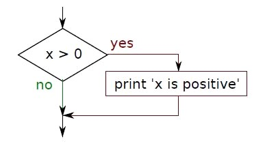
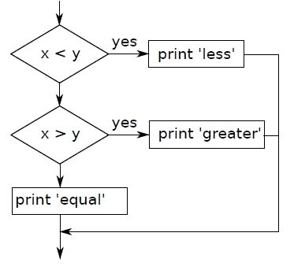

## 3.1    ლოგიკური გამოსახულება

ლოგიკური გამოსახულება არის გამოსახულება რომელიცაა მართალი ან მცდარი. შემდეგ გამოსახულებაში გამოყენებულია ოპერატორი == რაც ადარებს ორ ოპერანდს და თუ ერთმანეთის ტოლია შესაბამისად ამბობს, რომ მართალია ( True ) და თუ არა - მცდარი (False):

```python	
>>> 5 == 5
True
>>> 5 == 6
False
```

True (მართალი) და False (მცდარი) არის სპეციალური მნიშვნელობები, რომელიც ეკუთვნის bool ტიპს; ეს არაა სტრინგი:

```python	
>>> type(True)
<type 'bool'>
>>> type(False)
<type 'bool'>
```

ოპერატორი == ერთ-ერთი შედარების ოპერატორებიდან.

```python	
x != y  # x არაა y - ს ტოლი
x > y    # x არის y - ზე დიდი
x < y    # x არის y - ზე ნაკლები
x >= y  # x არის y - ზე მეტი ან ტოლი
x <= y  # x არის y - ზე  ნაკლები ან ტოლი
x is y # x არის იგიევე რაც y
x is not y # x არ არის იგივე რაც y
```

ეს სიმბოლოები შენთვის ალბათ ნაცნობია , თუმცა პითონის სიმბოლოები განსხვავებულია მათემატიკის სიმბოლოებისგან. ძირითადი შეცდომაა  ტოლობის ერთი ნიშნის (=) გამოყენება ორის (==) ნაცვლად. დაიმახსოვრე რომ ეს (=) არის გატოლების ნიშანი და  ეს (==) შედარების. არაა ასეთი ნიშნები => ან =<.

## 3.2 ლოგიკური ოპერატორები

არის სამი ლოგიკური ოპერატორი and, or და not ("და", "ან" და "არა" ). ამ ოპერატორების სემანტიკა (მნიშვნელობა) არის იგივე რაც ინგლისურად/ქართულად. მაგალითად:  

```python	
x > 0 and x < 10
```
არის მართალი მხოლოდ მაშინ, როცა x მეტია ვიდრე 0 და ნაკლები ვიდრე 10.

```python	
n % 2 == 0 or n % 3 == 0
```

არის მართალი მაშინ, როცა პირობის ერთი ნაწილი მაინც მართალია ანუ  n უნაშთოდ იყოფა 2 -ზე ან 3 - ზე.

ბოლო ოპერატორი უარყოფს ლოგიკურ გამოსახულებას. not (x > y) არის მართალი როცა x > y არის მცდარი, რაც ნიშნავს, რომ მაშინ x ნაკლებია ან ტოლი y - ზე.

მკაცრად რომ ვთქვათ ლოგიკური ოპერატორების ოპერანდები უნდა იყოს ლოგიკური გამოსახულებები, მაგრამ პითონი არ არის ძალიან მკაცრი და ნულის გარდა ნებისმიერი რიცხვი ითარგმნება როგორც მართალი (“true”).

```python	
>>> 17 and True
True
```

ეს დამყოლობა თუ მოქნილობა შეიძლება იყოს სასარგებლო , მაგრამ არის რაღაც დელიკატურობები რაც შეიძლება გახდეს გაუგებარი და შეიძლება მოგინდეს ამის თავიდან აცილება(თუ არ  იცი რას აკეთებ).


## 3.3   პირობითობის ოპერატორები

სასარგებლო პროგრამა რომ დავწეროთ, თითქმის ყოველთვის გვჭირდება შესაძლებლობა, რომ შევამოწმოთ პირობები და  შესაბამისად შევცვალოთ ქცევა. პირობითობის ცნებები  გვაძლევს შესაძლებლობას. ყველაზე მარტივი ფორმაა if "თუ" ბრძანება

```python	
if x > 0:
            print 'x is positive'
```

ლოგიკური გამოსახულება მას მერე რაც გამოიყენება if  ბრძანება, ხდება პირობა. if ბრძანება სრულდება ორწერტილით ( : ) და if ცნების შემდგომი ხაზები არის დაკბილული.


ლოგიკური პირობა მართალი თუა, მაშინ დაკბილული პირობა (print 'x is positive') განხორციელდება. თუ არაა სწორი, მაშინ დაკბილული პირობა არ შესრულდება.

if ბრძანებას აქვს ისეთი სტრუქტურა, როგორც ფუნქციას ან for მარყუჟს. ეს ბრძანება (if) შედგება თავი ხაზისგან(პირველი ხაზი) რომელიც მთავრდება ორწერტილით (:) და შემდეგ მოყვება დაკბილული ბლოკი. ასეთ ბრძანებებს ეძახიან "შედგენილ ბრძანებებს", იმიტომ რომ შედგებიან ერთზე მეტი ხაზისგან.
არ არის ლიმიტი თუ რამდენი ბრძანება უნდა გამოჩდეს კოდში(body,), მაგრამ  უნდა იყოს ერთი მაინც. პერიოდულად სასარგებლოა გვქონდეს კოდის სხეული ბრძანებების გარეშე(როგორც წესი ადგილის დასაკავებლად კოდისთვის, რომელიც ჯერ არ დაგიწერია). ამ შემთხვევაში შეგიძლია გამოიყენო pass ცნება, რომელიც არაფერს აკეთებს.

```python	
if x < 0:
      pass # need to handle negative values!
```

თუ დაწერ If ბრძანებას პითონის ინტერპრეტერში, პრომპტი შეიცვლება 3 შევრონიდან 3 წერტილზე რათა მიგითითოს, რომ ბლოკის შუა ნაწილში ხარ; როგორცაა ნაჩვენები ქვემოთ:
```python	
>>> x = 3
>>> if x < 10:
...     print 'Small'
...
Small
>>> 
```

## 3.4 ალტერნატიული განხორციელება
if ბრძანების მეორე ფორმაა ალტერნატიული განხორციელება, რაც ნიშნავს რომ არის ორი შესაძლებლობა და პირობა საზღვრავს რომელი განხორციელდება. სინტაქსი ასე გამოიყურება :

```python	
if x%2 == 0:
      print 'x is even'
else:
      print 'x is odd'
```
ორზე გაყოფის შემდეგ x - ს ნაშთი თუ ნულია, ესე იგი x არის ლუწი და პროგრამა გამოიტანს შესაბამის მესიჯს. ეს პირობა თუ მცდარია, მაშინ მეორე პირობა განხორციელდება.


## 3.5 მიჯაჭვული კავშირები

ხანდახან არის ორზე მეტი შესაძლებლობა და გვინდა ორზე მეტი ტოტი(კოდის) . ერთ-ერთი საშუალება გამოთვლის  გამოსახატად არის chained conditional (მიჯაჭვული კავშირი);

```python	
if x < y:
      print 'x is less than y'
elif x > y:
      print 'x is greater than y'
else:
      print 'x and y are equal'
```

elif არის “else if.” - ის აბრევიატურა.  კიდევ ერთხელ; ზუსტად ერთი ტოტი განხორციელდება.



elif ცნების რაოდენობაზე ლიმიტი არ არის. თუ არის else პირობა, ის უნდა იყოს კოდის ბოლოში, მაგრამ აქ არცერთის ყოფნაა არაა საჭირო:


```python	
if choice == 'a':
      print 'Bad guess'
elif choice == 'b':
      print 'Good guess'
elif choice == 'c':
      print 'Close, but not correct'
```

თითოეული პირობა შემოწმებულია რიგის მიხედვით. პირველი პირობა თუ მცდარია, შემოწმდება მეორე და. ა. შ. რომელიმე თუ მართალია შესაბამისი ტოტი განხორციელდება და ანგარიში მორჩება. თუ ერთზე მეტი პირობაა მართალი, მარტო პირველი მართალი ტოტი განხორციელდება.

## 3.6 Nested conditionals

პირობა შეიძლება ჩაბუდებული იყოს სხვა პირობაში. შეგვეძლო დაგვეწერა ასეც:


```python	
if x == y:
      print 'x and y are equal'
else:
      if x < y:
            print 'x is less than y'
      else:
            print 'x is greater than y'
```

ამ კოდს აქვს ორი ტოტი. პირველ ტოტში მარტივი ბრძანებაა , მეორე ტოტი შეიცავს სხვა if  პირობას, რომელსაც თავის მხრივ აქვს ორი ტოტი. ამ ორივე ტოტში მარტივი ბრძანებებია, თუმცა ეს ასევე შეიძლება ყოფილიყო პირობითი ცნებები


დაკბილულობა კოდს ხდის ხილვადს. დაბუდებული პირობითი  კავშირები  არის ძნელად წასაკითხი და ზოგადად კარგი იქნება თუ აირიდებ მსგავს კოდს.
ლოგიკური ოპერატორები ხშირად უზრუნველყოფენ გზას, რომ გაამარტივო ჩაბუდებული კავშირები. მაგალითად, შეგვიძლია გადავწეროთ კოდი ერთი პირობის გამოყენებით:

```python	
if 0 < x:
      if x < 10:
            print 'x is a positive single-digit number.'
```

print ბრძანება განხორციელდება თუ ორივე პირობა შესრულდება. ასეთივე კოდის დაწერა შეგვიძლია and ოპერატორის დახმარებით


```python	
if 0 < x and x < 10:
      print 'x is a positive single-digit number.'
```


